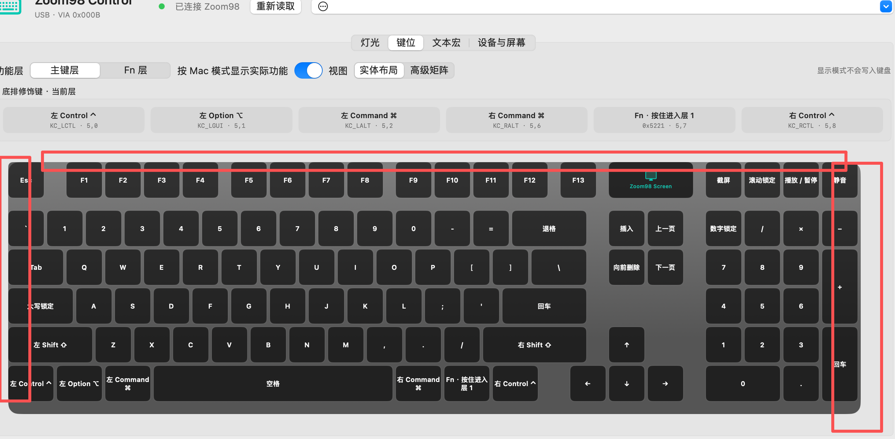

# Zoom98 Control for macOS

一款非官方、原生 SwiftUI 的 Zoom98 键盘配置工具。它通过 macOS IOKit 直接访问键盘的
32 字节 VIA HID 接口，不需要常驻后台。

> 本项目与 Meletrix、Wuque Studio 没有隶属或授权关系。请先导出配置，并自行承担修改
> 键位、灯效与宏的风险。



## 当前功能

- 识别 USB Zoom98（VID `0x1EA7` / PID `0xCD68`）
- 读取和调整轴下灯（RGB Matrix）的颜色、亮度、速度和已识别灯效
- 用接近 Zoom98 实物的布局读取和编辑主键层与 Fn 层
- 支持普通键、macOS 可用媒体键以及 16 个固件文本宏
- 写入后回读校验，并支持撤销最近一次改键
- 导入、导出 JSON 配置，并在导入异常时回滚
- 通过 BLE 连接 `Zoom98 Screen`，读取固件信息和发送已确认的屏幕命令
- 尝试从独立的 BLE HID 电量服务读取键盘电量

## 已知限制

- 当前 Zoom98 固件虽然会保存 QMK 组合键码，但实测不会执行，因此界面不再提供组合键写入
- `KC_CALC`、邮件、浏览器等 Windows 消费控制键在 macOS 上没有对应系统动作
- 文本宏受键盘固件容量和 ASCII 字符集限制
- 屏幕与键盘控制器是两个 BLE 设备；屏幕连接本身不能提供键盘电量
- 蓝牙广播名称没有公开的可写 `Device Name (2A00)` 特征，当前无法可靠改名
- 侧边灯条（Bottom Light）可由固件快捷键独立控制，但尚未找到可用的软件协议

## 系统要求

- macOS 14 或更高版本
- Apple Silicon Mac（当前发布包为 arm64）
- 使用配置功能时通过 USB 连接 Zoom98
- 首次访问 HID 接口时，可能需要为 App 开启“输入监控”权限

## 构建

生成可双击的 App：

```sh
./scripts/build-app.sh
```

输出位于 `dist/Zoom98 Control.app`。

开发运行：

```sh
swift run
```

发布包采用本机临时签名，并未经过 Apple Developer ID 公证。其他 Mac 第一次打开时可能需要
在“系统设置 → 隐私与安全性”中确认。

## 侧边灯条研究结论

官方固件确实把 Bottom Light 与轴下灯分开控制，但目前发现的 VIA 命令和厂商私有
`ReadFirmwareLightEffect` 命令都只返回轴下灯状态。扫描私有字段也没有找到第二组灯光值。
因此本工具只展示已确认的固件快捷键，不把无响应的 VIA `RGB Light` 字段伪装成可用控件。
要实现真正的软件侧灯控制，需要继续逆向或修改键盘固件，新增一个 HID 命令。

## 仓库内容

本仓库只收录 macOS 工具源码、构建脚本和设计资料，不包含厂商 APK、Windows 驱动、
固件镜像或反编译数据库。可运行 ZIP 请从 GitHub Releases 下载。
